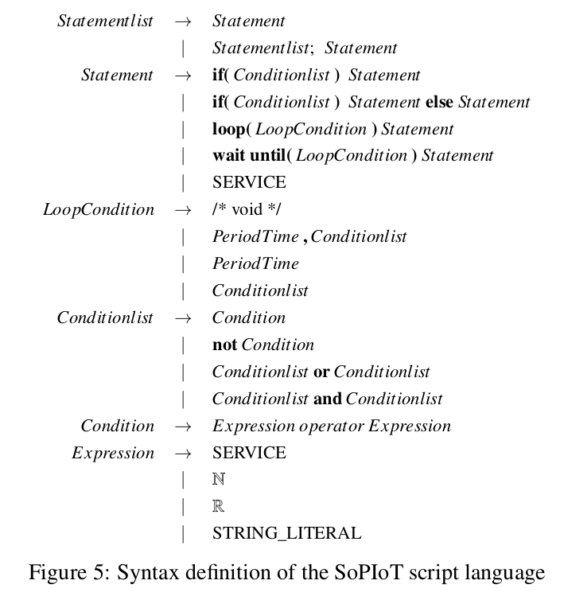

논문 읽을 일이 생겨서 읽으면서 메모합니다.

# SoPIoT 구조 개요

위 그림이 개요도입니다. 
- User는 Script Editor를 이용합니다. 프로그래밍 잘 모르는 사람들도 할 수 있도록 script language를 지원해서, 쉽게 서비스를 이용할 수 있게 합니다. 에디터는 Middleware 와 연결되어 있고, Middleware는 각 device와 연결되어 있습니다.   

- Device가 middleware에 등록되는데 이때 device가 제공하는 서비스가 함께 등록되나?봅니다 그래서 service oriented 라고 이름 붙였고..  Device에는 unconstrained(OS를 로드하고 TCP/IP를 사용할 수 있을 정도로 강력한 애들)와 constrained device가 있는데 후자는 Gateway 를 거칩니다. Middleware와 device를 연결하는 데에 MQTT, MQTT-sn 등의 프로토콜이 사용됩니다.  

- middleware와 thing이 있는데, thing에는 다시 big-thing과 small-thing이 있습니다. big-thing은 미들웨어와 MQTT로

- Middleware들은 database를 가져서, device들로부터 온 데이터를 저장합니다. 또 local administration server와 연결되어 있어서 admin server와 device들을 중개합니다.  

- admin server들은 1. device로부터 big data 를 모으고, 2. GUI를 유저에게 제공하고 3. logging server 역할을 합니다. 

- Clouds computing environments는 big data analysis, machine learning 부분을 담당합니다. cloud 가 virtual device 형태로 등록된다는게 뭔소리지..?

# Service abstraction of devices

각 device는 다른 device에 영향을 주지 않으면서, platform에 등록되어 동작합니다. 
- service abstration은 identifier, values, service functions의 세 부분으로 구성됩니다.
- device가 SoPIoT 에 통합되려면, device에 device module을 설치해야 합니다. device module 안에는 resource manager와 function manager가 있는데 concurrent하게 돌아갑니다. 'alive' message를 보내고..? 

# Composite services (script language)

SoPIoT는 아래 사진과 같이 문법이 정의된 스크립트 언어를 통해 user가 device services를 이용할 수 있게 하는데, 컴파일러 듣고 나니까 이게 뭔지 좀 알겠습니다.. 기본적으로 `class.function` 혹은 `name.function` 과 같은 방식으로 service가 표현됩니다. `if-else`, `loop`, `wait until` 등의 키워드를 사용해서 명령을 내릴 수 있나 봅니다. script language 는 composite service를 위해 고안된 것이고, python 같은 general-purpose language는 아닙니다. python 과는 달리 일반 유저도 쉽게 사용할 수 있도록 간단하게 만들어진 것 같습니다. 

- $G = (S, C, L, E)$. 
- $G$ : composite service graph
- $S$
- $C$
- $L$
- $E$

# Central middleware

Middleware 입니다. 

# Thing
big thing 과 small thing 이 있습니다. big thing은 자신이 직접 broker에게 publish합니다. small thing은 전력 소모 줄이기 위해 MQTT-sn 이라는 상대적으로 작은 정보들만 오고가는 프로토콜을 쓰고, Gateway에서 small thing으로부터 온 것들을 취합해서 publish 합니다.  
small thing은 어떤 broker에 붙을지 ino 코드상에서 결정하는 게 아니고 ZigBee 통신을 통해? 결정한다고 합니다. 